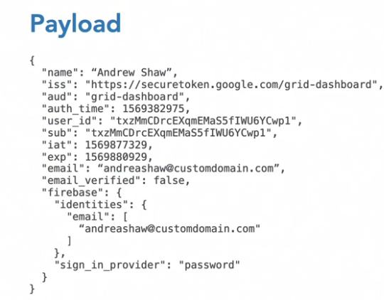
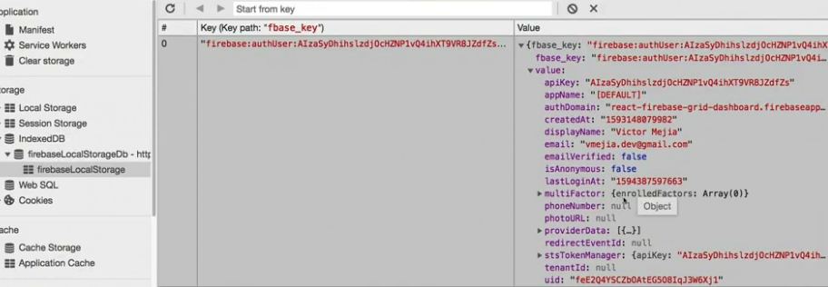
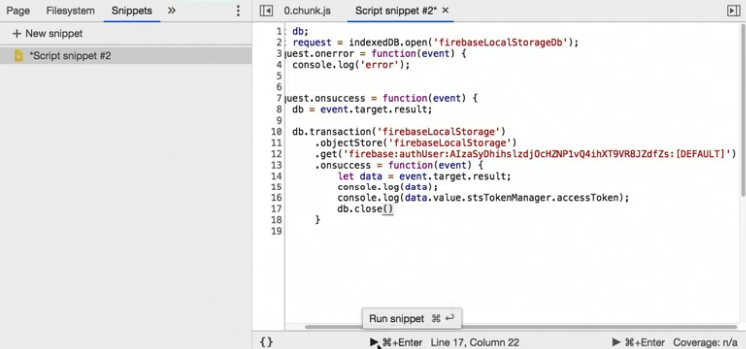

# 
Add custom field to firebase token










jwt.io


Install Firebase Admin SDK
``
  npm i firebase-admin@8.12.1 
```

Project Settings -> Service accounts -> Generate new private key


Set custom claim
```
node src/firebase/set-custom.claims.js <the user id copyed from firebase auth database>
```

Read custom claim from token
```
  isAdmin = token.claims.admin;

  const token = await user.getIdTokenResult();
  if (token.claims.admin) {
    props.history.push('/users');
  } else {
    props.history.push(`/profile/${user.uid}`);
  }
```

Create AdminRoute to check isAdmin


Change the store rule and storage and re-deploy
```
   allow read, write, update : if request.auth.uid == userId 
          ||request.auth.token.admin == true;
```

```
   allow read: if request.auth.uid == userId ||request.auth.token.admin == true;
```

npm run deploy:firestore
npm run deploy:storage

